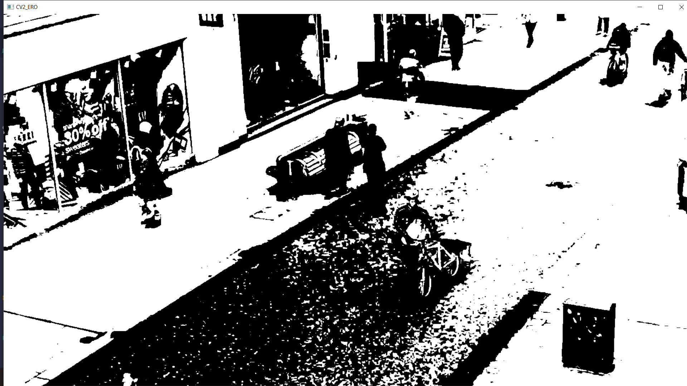
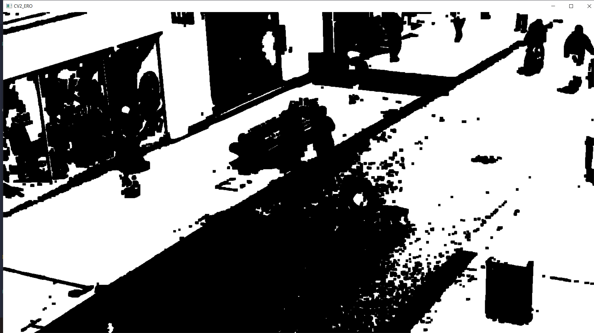
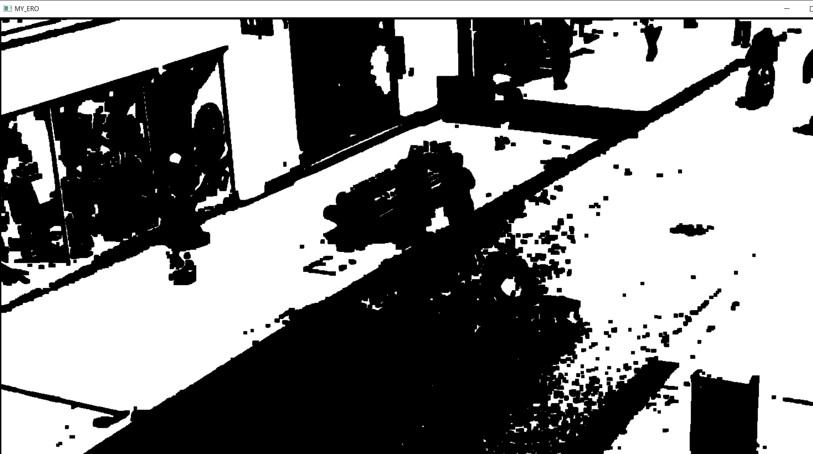

# Лабораторная работа 1

## Цель
Научиться реализовывать один из простых алгоритмов обработки изображения

## Вариант
Эрозия бинаризированного изображения

## Теория
Эрозия это одна из двух базовых операций математической морфологии изображений помимо dilation(расширения). В основном 
применятся к бинаризированным изображениям, но также может применятся и к grayscale изображениям. После применения 
эрозии к бинаризированному изображению получается следующий эффект: разрушаются границы объектов изображения на 
переднем плане, обычно белые пиксели. Вследствие чего размеры этих объектов уменьшаются и увеличиваются зоны между ними.

Операция эрозии принимает 2 входных параметра: изображение, с которым будет проведено преобразование и структурный 
элемент(ядро). Структурный элемент определяет точность/объем эрозии на изображении.

Структурный элемент задает размер матрицы, которая по своей сути является границами области определяющей стоит ли 
изменять пиксель или нет. Для каждого белого пикселя( пикселя объектов на переднем плане) применяется структурный 
элемент таким образом, что что пиксель должен находиться в центре структурного элемента, и , если все пиксели вокруг
него входящие в границы заданного структурного элемента тоже являются 1(белые), то пиксель сохраняет свое значение(цвет), 
в противном случае он его меняет на противоположное.

Существует множество кейсов для применения данной операции, такие как удаление белых шумов и разделение 
соприкасающихся объектов.

## Описание программы
### Эрозия с помощью opencv
1. Пребразование изображение в оттенки серого   
```python
grayframe = cv2.cvtColor(frame, cv2.COLOR_BGR2GRAY)
ret, grayframe = cv2.threshold(grayframe, 127, 255, cv2.THRESH_BINARY)
```
2. Бинаризация
```python
ret, grayframe = cv2.threshold(grayframe, 127, 255, cv2.THRESH_BINARY)
```
3. Создание ядра
```python
kernel = np.full((6, 6), fill_value=255)
```
4. Применение эрозии
```python
cv2_ero = cv2.erode(grayframe, kernel, iterations=1)
```
5. Вывод изображения
```python
cv2.imshow('CV2_ERO', cv2_ero)
```

### Эрозия без opencv
1. Пребразование изображение в оттенки серого, бинаризация и создание ядра аналогично предыдущему способу
2. Добавление отступов к изображению для учета ядра по краям изображения
```python
image_pad = np.pad(array=image_file, pad_width=pad_width, mode='constant')
```
3. Деление изображения на подматрицы размером с ядро
```python
flat_submatrices = np.array([
    image_pad[i:(i + erosion_level), j:(j + erosion_level)]
    for i in range(pimg_shape[0] - h_reduce) for j in range(pimg_shape[1] - w_reduce)
])
```
4. Выполнение эрозии (Если все значения подматрицы равны значениям ядра эрозии, то в новом изображении в соответствующей 
позиции ставится значение 255, иначе - 0)
```python
image_erode = np.array([255 if (i == structuring_kernel).all() else 0 for i in flat_submatrices], dtype=np.uint8)
```

## Результаты
Скриншот исходного видео:


В результате бинаризации кадров исходного видео и применения к ним эрозии, реализованной с использованием библиотеки 
OpenCV, видео изменилось следующим образом:


В результате бинаризации кадров исходного видео и применения к ним эрозии, реализованной без использования 
дополнительных библиотек, видео изменилось следующим образом:


Для сравнения реализованных алгоритмов была измерена производительность, подсчитано среднее кол-во кадров в
секунду при отображении измененного видео, ниже представлены результаты обоих алгоритмов

1) Алгоритм с использованием библиотеки OpenCV

Frames per second: 60.50340260090959
Total frames: 250
Duration: 4.1319990158081055

2) Алгоритм без использования дополнительных библиотек

Frames per second: 0.08831341823282651
Total frames: 60
Duration: 679.3984560966492

## Вывод
В ходе выполнения данной лабораторной работы, ознакомились с базовым использование Jetson плат, операцией эрозии и 
бинаризации изображений, библиотекой OpenCV. В процессе работы были реализованы алгоритмы эрозии с использованием 
библиотеки OpenCV и этот же алгоритм без использования библиотек и проведен сравнительный анализ полученных результатов.
